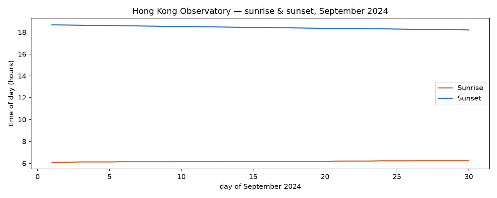

# The phenomenon
## Times of sunrise and sunset
9.22 is the autumnal equinox, and from this day on, the daylight hours will decrease, with longer nighttime hours than daylight hours.
<!-- This is the SD5913 assignment 2 template. Everything in this file is yours to
replace, and the check counts words: comments like this one are not words, so
delete each one as you write. Start with the heading: name the phenomenon.

Then, in this order, at least 150 words in total.

New to folders, paths, or the files here whose names start with a dot? Read
https://github.com/sd5913/pfad/blob/2026/reference/files.md first. Ten minutes. -->



## The phenomenon
The sunrise time is getting later and the sunset time is getting earlier, and the daily sunshine time is gradually decreasing.
<!-- What goes up and down, and why you looked at it. -->

## The source
"https://data.weather.gov.hk/weatherAPI/opendata/opendata.php"
       "?dataType=SRS&rformat=json&year=2024&month=9"

The dataset contains 30 rows. Each row represents "YYYY-MM-DD","RISE","TRAN.","SET"
<!-- A link to the page or endpoint the file came from, and one line on what is in
the file: how many rows, what a row means, what the units are. -->

## What the picture shows
第The first image shows the changes in sunrise and sunset times in September 2024, and the second image shows the length of daylight hours per day and their relationship with the autumnal equinox. It can be seen that after the 26th, the nighttime hours are longer than the daylight hours.
<!-- Two or three sentences. Including what it hides: every transformation throws
something away, and naming what yours threw away is the easiest way to sound like
you know what you did. -->

## Run it

```
uv run fetch.py
uv run plot.py
```
